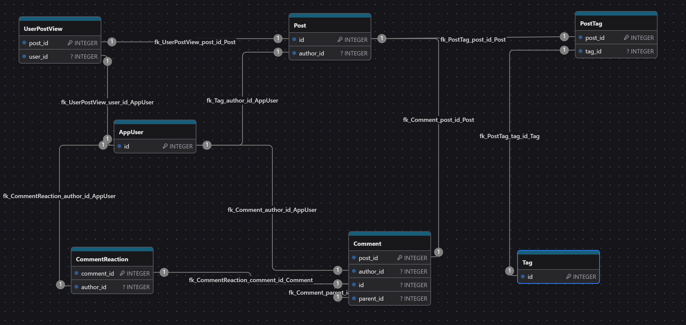

# Blog Platform
Многофункциональная backend-платформа для блогов, реализованная на FastAPI, с поддержкой асинхронного доступа к базе данных, кэшированием через Redis, ролевой авторизацией, системой комментариев, реакций, тегов, просмотров и планировщиком задач.


# Аутентификация JWT и безопасность
Access и Refresh токены JWT. Передаются на клиент в виде http-only cookie

Refresh токен сохраняется в Redis для возможности его отозвать

На logout, refresh операциях проверяется наличие Refresh токена в Redis

Access токены не сохраняется, в текущей имплементации отозвать невозможно.
Если необходимо можно сделать аналог white list, добавив пользователю признак активности is_active. 

Для защиты от IDOR применяется доступ с API исключительно по UUID

Пароли пользователей хешируются argon2id

## Доступ по RBAC
На основе роле и разрешений


# Scheduling
Используется ARQ Worker, Redis выступает транспортом задач

Scheduler обновляется счётчик кол-ва просмотров поста от авторизованных пользователей и делает отложенные публикации

# Cache
Используется Redis в качестве кэша, кешируется только find_published_posts метод

# Управление сущностями
## Tags
Доступ и менеджемент только для администраторов

## Posts
Редактировать пост может исключительно автор оригинального поста.
Публиковать: ADMIN, AUTHOR
Удалять: ADMIN, AUTHOR (если является автором оригинала)

## Comments
Редактировать комментарии может исключительно автор оригинального комментария.
Публиковать: ADMIN, AUTHOR, USER

Модерировать: ADMIN

Удалять: ADMIN, (Автор комментария)

### CommentsReaction
Аутентифицированные пользователи могут реагировать на комментарии, выбирая следующие значения:
"😡" "🎉" "😂" "❤️" "👎" "👍"

## UserPostView
Счётчики просмотров управляются сервисом автоматически

# Тесты
Pytest, plugin anyio

## Запуск в Docker
````
docker compose up --build blog_platform_backend
docker-compose exec blog_platform_backend pytest
````

# Запуск проекта в Docker Compose
Иметь доступ до
1. Docker Repository
2. Pip репозиториев
3. Swagger cdn сервиса: https://cdn.jsdelivr.net/npm/swagger-ui-dist@5/swagger-ui-bundle.js
4. Убедиться в доступности порта 9002

Запуск
````
docker compose up --build
# открыть в бразуере # localhost:9002/docs#
````

Миграция alembic c тестовыми данными и индексами применится автоматически

У всех пользователей в системе незахешированный пароль "password"
Пользователи:

|      Логин         |  Роль   |
|:-------------------|:-------:|
| admin@yandex.ru    | ADMIN   |
| user1@yandex.ru    | USER    |
| author@yandex.ru   | AUTHOR  |
| user2@yandex.ru    | USER    |


# Схема БД
